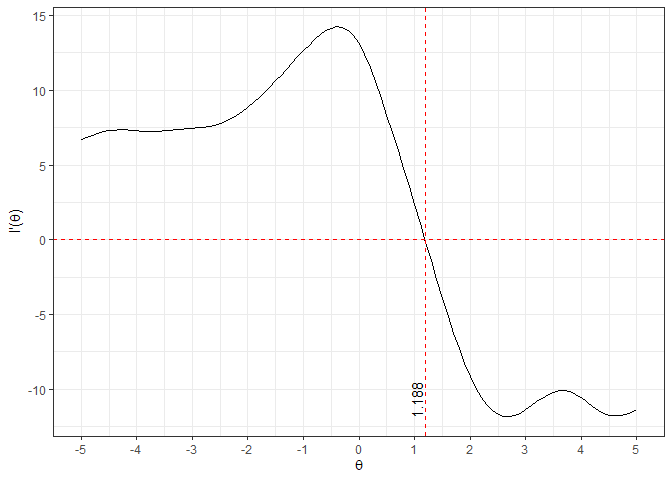

<!-- README.md is generated from README.Rmd. Please edit that file -->

# optimization

<!-- badges: start -->
<!-- badges: end -->

The goal of optimization is to provided functions for finding roots.

## Installation

Install this package from GitHub. You will need to install `devtools` if
you do not already have it.

``` r
# install.packages('devtools')
devtools::install_github('ConGibbs10/optimization')
#> Skipping install of 'optimization' from a github remote, the SHA1 (2294bcf2) has not changed since last install.
#>   Use `force = TRUE` to force installation
```

## Example

This is a basic example which shows you how to find roots with
`optimization`. Suppose
*X*<sub>1</sub>, …, *X*<sub>25</sub> ∼ Cauchy(*θ*, 1). Then, one can
derive the log-likelihood and its first and second derivatives.
Furthermore, one can derive the Fisher information. These functions,
univariate in theta, are coded in `R` below.

``` r
library(optimization)

# log-likelihood
ll <- function(theta){
  obs <- c(-8.86, -6.82, -4.03, -2.84, 0.14, 0.19, 0.24, 0.27, 0.49, 0.62, 0.76, 1.09, 
         1.18, 1.32, 1.36, 1.58, 1.58, 1.78, 2.13, 2.15, 2.36, 4.05, 4.11, 4.12, 6.83)
  n <- length(obs)
  ll <- -n*log(pi) - sum(log(1 + (obs - theta)^2))
  return(ll)
}

# first derivative of log-likelihood
d1ll <- function(theta){
  obs <- c(-8.86, -6.82, -4.03, -2.84, 0.14, 0.19, 0.24, 0.27, 0.49, 0.62, 0.76, 1.09, 
         1.18, 1.32, 1.36, 1.58, 1.58, 1.78, 2.13, 2.15, 2.36, 4.05, 4.11, 4.12, 6.83)
  return(sum((2*(obs - theta))/(1 + (obs - theta)^2)))
}

# second derivative of log-likelihood
d2ll <- function(theta){
  obs <- c(-8.86, -6.82, -4.03, -2.84, 0.14, 0.19, 0.24, 0.27, 0.49, 0.62, 0.76, 1.09, 
         1.18, 1.32, 1.36, 1.58, 1.58, 1.78, 2.13, 2.15, 2.36, 4.05, 4.11, 4.12, 6.83)
  return(sum((-2*(1 - (obs - theta)^2)) / ((1 + (obs - theta)^2)^2)))
}

# fisher information
fi <- function(theta){1/2}
```

Let’s take a look at the derivative of the log-likelihood.

``` r
vd1ll <- Vectorize(d1ll)
root <- uniroot(vd1ll, lower = -5, upper = 5)$root
ggplot(data = data.frame(x = 0), aes(x = x)) +
  stat_function(fun = vd1ll) + 
  geom_hline(yintercept = 0, color = 'red', linetype = 'dashed') +
  geom_vline(xintercept = root, color = 'red', linetype = 'dashed') +
  geom_text(data = data.frame(x = root, y = -10.75),
            aes(x = x, y = y, label = format(root, digits = 4)),
            inherit.aes = FALSE, angle = 90, vjust = -.25) +
  scale_x_continuous(bquote(theta), limits = c(-5, 5), breaks = seq(-5, 5, by = 1)) +
  scale_y_continuous(expression(paste("l'(", theta, ")"))) +
  theme_bw()
```



I’ll now demonstrate how to find the root with each of the included
numerical methods.

### Bisection

``` r
mresults <- list()
mresults$bisection <- 
  unibisection(gp = d1ll,          # derivative of log-likelihood
               a = 1,              # left endpoint
               b = 2,              # right endpoint
               eps = 1e-6,         # tolerance 
               maxIter = 10000)    # maximum number of iterations to perform
```

### Secant

``` r
mresults$secant <- 
  unisecant(gp = d1ll,        # derivative of log-likelihood
            a = 0,            # left endpoint
            b = 2,            # right endpoint
            eps = 1e-6,       # tolerance 
            maxIter = 10000)  # maximum number of iterations to perform
```

### Newton-Raphson

``` r
mresults$newton <- 
  uninewton(gp = d1ll,        # derivative of log-likelihood
            gpp = d2ll,       # second derivative of log-likelihood
            a = 1,            # initial guess
            eps = 1e-6,       # tolerance       
            maxIter = 10000)  # maximum number of iterations to perform
```

### Fisher Scoring

``` r
mresults$fisher <- 
  unifisher(lp = d1ll,        # derivative of log-likelihood
            fisherInfo = fi,  # fisher information
            n = 25,           # sample size
            a = 1,            # initial guess
            eps = 1e-6,       # tolerance       
            maxIter = 10000)  # maximum number of iterations to perform)
```

## Results

After approximating the root using each method, the results can be
summarized in the following table:

<style>html {
  font-family: -apple-system, BlinkMacSystemFont, 'Segoe UI', Roboto, Oxygen, Ubuntu, Cantarell, 'Helvetica Neue', 'Fira Sans', 'Droid Sans', Arial, sans-serif;
}

#jzazzsowrx .gt_table {
  display: table;
  border-collapse: collapse;
  margin-left: auto;
  margin-right: auto;
  color: #333333;
  font-size: 16px;
  font-weight: normal;
  font-style: normal;
  background-color: #FFFFFF;
  width: auto;
  border-top-style: solid;
  border-top-width: 2px;
  border-top-color: #A8A8A8;
  border-right-style: none;
  border-right-width: 2px;
  border-right-color: #D3D3D3;
  border-bottom-style: solid;
  border-bottom-width: 2px;
  border-bottom-color: #A8A8A8;
  border-left-style: none;
  border-left-width: 2px;
  border-left-color: #D3D3D3;
}

#jzazzsowrx .gt_heading {
  background-color: #FFFFFF;
  text-align: center;
  border-bottom-color: #FFFFFF;
  border-left-style: none;
  border-left-width: 1px;
  border-left-color: #D3D3D3;
  border-right-style: none;
  border-right-width: 1px;
  border-right-color: #D3D3D3;
}

#jzazzsowrx .gt_title {
  color: #333333;
  font-size: 125%;
  font-weight: initial;
  padding-top: 4px;
  padding-bottom: 4px;
  border-bottom-color: #FFFFFF;
  border-bottom-width: 0;
}

#jzazzsowrx .gt_subtitle {
  color: #333333;
  font-size: 85%;
  font-weight: initial;
  padding-top: 0;
  padding-bottom: 4px;
  border-top-color: #FFFFFF;
  border-top-width: 0;
}

#jzazzsowrx .gt_bottom_border {
  border-bottom-style: solid;
  border-bottom-width: 2px;
  border-bottom-color: #D3D3D3;
}

#jzazzsowrx .gt_col_headings {
  border-top-style: solid;
  border-top-width: 2px;
  border-top-color: #D3D3D3;
  border-bottom-style: solid;
  border-bottom-width: 2px;
  border-bottom-color: #D3D3D3;
  border-left-style: none;
  border-left-width: 1px;
  border-left-color: #D3D3D3;
  border-right-style: none;
  border-right-width: 1px;
  border-right-color: #D3D3D3;
}

#jzazzsowrx .gt_col_heading {
  color: #333333;
  background-color: #FFFFFF;
  font-size: 100%;
  font-weight: normal;
  text-transform: inherit;
  border-left-style: none;
  border-left-width: 1px;
  border-left-color: #D3D3D3;
  border-right-style: none;
  border-right-width: 1px;
  border-right-color: #D3D3D3;
  vertical-align: bottom;
  padding-top: 5px;
  padding-bottom: 6px;
  padding-left: 5px;
  padding-right: 5px;
  overflow-x: hidden;
}

#jzazzsowrx .gt_column_spanner_outer {
  color: #333333;
  background-color: #FFFFFF;
  font-size: 100%;
  font-weight: normal;
  text-transform: inherit;
  padding-top: 0;
  padding-bottom: 0;
  padding-left: 4px;
  padding-right: 4px;
}

#jzazzsowrx .gt_column_spanner_outer:first-child {
  padding-left: 0;
}

#jzazzsowrx .gt_column_spanner_outer:last-child {
  padding-right: 0;
}

#jzazzsowrx .gt_column_spanner {
  border-bottom-style: solid;
  border-bottom-width: 2px;
  border-bottom-color: #D3D3D3;
  vertical-align: bottom;
  padding-top: 5px;
  padding-bottom: 6px;
  overflow-x: hidden;
  display: inline-block;
  width: 100%;
}

#jzazzsowrx .gt_group_heading {
  padding: 8px;
  color: #333333;
  background-color: #FFFFFF;
  font-size: 100%;
  font-weight: initial;
  text-transform: inherit;
  border-top-style: solid;
  border-top-width: 2px;
  border-top-color: #D3D3D3;
  border-bottom-style: solid;
  border-bottom-width: 2px;
  border-bottom-color: #D3D3D3;
  border-left-style: none;
  border-left-width: 1px;
  border-left-color: #D3D3D3;
  border-right-style: none;
  border-right-width: 1px;
  border-right-color: #D3D3D3;
  vertical-align: middle;
}

#jzazzsowrx .gt_empty_group_heading {
  padding: 0.5px;
  color: #333333;
  background-color: #FFFFFF;
  font-size: 100%;
  font-weight: initial;
  border-top-style: solid;
  border-top-width: 2px;
  border-top-color: #D3D3D3;
  border-bottom-style: solid;
  border-bottom-width: 2px;
  border-bottom-color: #D3D3D3;
  vertical-align: middle;
}

#jzazzsowrx .gt_from_md > :first-child {
  margin-top: 0;
}

#jzazzsowrx .gt_from_md > :last-child {
  margin-bottom: 0;
}

#jzazzsowrx .gt_row {
  padding-top: 8px;
  padding-bottom: 8px;
  padding-left: 5px;
  padding-right: 5px;
  margin: 10px;
  border-top-style: solid;
  border-top-width: 1px;
  border-top-color: #D3D3D3;
  border-left-style: none;
  border-left-width: 1px;
  border-left-color: #D3D3D3;
  border-right-style: none;
  border-right-width: 1px;
  border-right-color: #D3D3D3;
  vertical-align: middle;
  overflow-x: hidden;
}

#jzazzsowrx .gt_stub {
  color: #333333;
  background-color: #FFFFFF;
  font-size: 100%;
  font-weight: initial;
  text-transform: inherit;
  border-right-style: solid;
  border-right-width: 2px;
  border-right-color: #D3D3D3;
  padding-left: 12px;
}

#jzazzsowrx .gt_summary_row {
  color: #333333;
  background-color: #FFFFFF;
  text-transform: inherit;
  padding-top: 8px;
  padding-bottom: 8px;
  padding-left: 5px;
  padding-right: 5px;
}

#jzazzsowrx .gt_first_summary_row {
  padding-top: 8px;
  padding-bottom: 8px;
  padding-left: 5px;
  padding-right: 5px;
  border-top-style: solid;
  border-top-width: 2px;
  border-top-color: #D3D3D3;
}

#jzazzsowrx .gt_grand_summary_row {
  color: #333333;
  background-color: #FFFFFF;
  text-transform: inherit;
  padding-top: 8px;
  padding-bottom: 8px;
  padding-left: 5px;
  padding-right: 5px;
}

#jzazzsowrx .gt_first_grand_summary_row {
  padding-top: 8px;
  padding-bottom: 8px;
  padding-left: 5px;
  padding-right: 5px;
  border-top-style: double;
  border-top-width: 6px;
  border-top-color: #D3D3D3;
}

#jzazzsowrx .gt_striped {
  background-color: rgba(128, 128, 128, 0.05);
}

#jzazzsowrx .gt_table_body {
  border-top-style: solid;
  border-top-width: 2px;
  border-top-color: #D3D3D3;
  border-bottom-style: solid;
  border-bottom-width: 2px;
  border-bottom-color: #D3D3D3;
}

#jzazzsowrx .gt_footnotes {
  color: #333333;
  background-color: #FFFFFF;
  border-bottom-style: none;
  border-bottom-width: 2px;
  border-bottom-color: #D3D3D3;
  border-left-style: none;
  border-left-width: 2px;
  border-left-color: #D3D3D3;
  border-right-style: none;
  border-right-width: 2px;
  border-right-color: #D3D3D3;
}

#jzazzsowrx .gt_footnote {
  margin: 0px;
  font-size: 90%;
  padding: 4px;
}

#jzazzsowrx .gt_sourcenotes {
  color: #333333;
  background-color: #FFFFFF;
  border-bottom-style: none;
  border-bottom-width: 2px;
  border-bottom-color: #D3D3D3;
  border-left-style: none;
  border-left-width: 2px;
  border-left-color: #D3D3D3;
  border-right-style: none;
  border-right-width: 2px;
  border-right-color: #D3D3D3;
}

#jzazzsowrx .gt_sourcenote {
  font-size: 90%;
  padding: 4px;
}

#jzazzsowrx .gt_left {
  text-align: left;
}

#jzazzsowrx .gt_center {
  text-align: center;
}

#jzazzsowrx .gt_right {
  text-align: right;
  font-variant-numeric: tabular-nums;
}

#jzazzsowrx .gt_font_normal {
  font-weight: normal;
}

#jzazzsowrx .gt_font_bold {
  font-weight: bold;
}

#jzazzsowrx .gt_font_italic {
  font-style: italic;
}

#jzazzsowrx .gt_super {
  font-size: 65%;
}

#jzazzsowrx .gt_footnote_marks {
  font-style: italic;
  font-size: 65%;
}
</style>
<div id="jzazzsowrx" style="overflow-x:auto;overflow-y:auto;width:auto;height:auto;"><table class="gt_table">
  
  <thead class="gt_col_headings">
    <tr>
      <th class="gt_col_heading gt_columns_bottom_border gt_left" rowspan="1" colspan="1">Method</th>
      <th class="gt_col_heading gt_columns_bottom_border gt_left" rowspan="1" colspan="1">Estimate</th>
      <th class="gt_col_heading gt_columns_bottom_border gt_left" rowspan="1" colspan="1">Iterations</th>
    </tr>
  </thead>
  <tbody class="gt_table_body">
    <tr>
      <td class="gt_row gt_left">Bisection</td>
      <td class="gt_row gt_left">1.188</td>
      <td class="gt_row gt_left">18</td>
    </tr>
    <tr>
      <td class="gt_row gt_left">Secant</td>
      <td class="gt_row gt_left">1.188</td>
      <td class="gt_row gt_left"> 3</td>
    </tr>
    <tr>
      <td class="gt_row gt_left">Newton</td>
      <td class="gt_row gt_left">1.188</td>
      <td class="gt_row gt_left"> 2</td>
    </tr>
    <tr>
      <td class="gt_row gt_left">Fisher</td>
      <td class="gt_row gt_left">1.188</td>
      <td class="gt_row gt_left"> 3</td>
    </tr>
  </tbody>
  
  
</table></div>

Every method approximates the root to the same precision as `uniroot()`.
